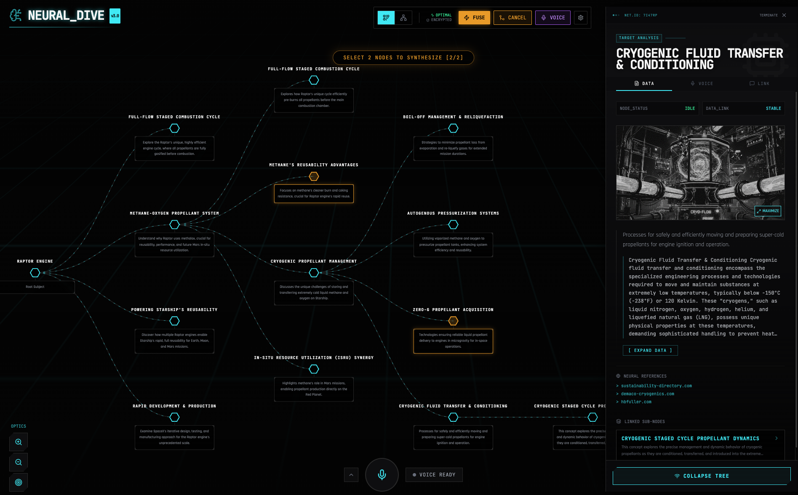

<div align="center">
  
</div>

# 🧠 Neural Dive

> **AI Partner Catalyst Hackathon - ElevenLabs Challenge Entry**
>
> A voice-driven, AI-powered knowledge exploration platform that combines interactive mind mapping with natural voice interaction.

[](https://firebase.google.com/)
[](https://deepmind.google/technologies/gemini/)
[](https://elevenlabs.io/)
[](https://react.dev/)
[](https://www.typescriptlang.org/)

## 🎯 Hackathon Challenge

This project was built for the **AI Partner Catalyst: Accelerate Innovation** hackathon, specifically for the **ElevenLabs Challenge**:

> *"Use ElevenLabs and Google Cloud AI to make your app conversational, intelligent, and voice-driven. Combine ElevenLabs Agents with Google Cloud Vertex AI or Gemini to give your app a natural, human voice and personality — enabling users to interact entirely through speech."*

## ✨ Features

### 🗣️ Voice-First Experience
- **Voice Commands**: Explore topics, navigate, and control the app entirely through speech
- **Natural Voice Responses**: ElevenLabs-powered text-to-speech with multiple voice profiles
- **Real-time Transcription**: Web Speech API integration for instant voice recognition

### 🧠 AI-Powered Knowledge Exploration
- **Dynamic Mind Mapping**: Interactive D3.js visualization of knowledge graphs
- **Concept Synthesis**: Merge two topics to discover their intersection
- **Smart Suggestions**: AI-generated exploration paths based on your interests

### 🔒 Privacy-First Architecture
- **Bring Your Own Key (BYOK)**: API keys are stored locally in your browser
- **No Backend Tracking**: Direct connection from client to Google/ElevenLabs APIs
- **Secure Storage**: Keys can be cleared instantly with a single click

### 🎨 Cyberpunk Aesthetic
- **Immersive UI**: HUD-style interfaces with neon accents and smooth animations
- **Multiple Views**: Switch between tree and network graph visualizations
- **Boot Sequence**: Atmospheric startup animation

## 🛠️ Technology Stack

### Google Cloud Integration
- **Firebase Hosting**: Fast, secure global CDN deployment
- **Gemini 2.5 Flash**: Core AI model for content generation and reasoning
- **Gemini Image Generation**: AI-generated visual representations
- **Google Search Grounding**: Fact-verified content with source citations

### ElevenLabs Integration
- **Text-to-Speech**: Natural voice synthesis with multiple voice profiles
- **Voice Profiles**: Neural, Assistant, Narrator, and Cyber personas
- **Multilingual Support**: ElevenLabs Multilingual v2 model

### Frontend
- **React 19**: Latest React with concurrent features
- **TypeScript**: Full type safety throughout
- **D3.js**: Interactive data visualizations
- **Tailwind CSS**: Utility-first styling
- **Vite**: Lightning-fast development and builds

## 🚀 Quick Start

### 1. Installation

```bash
# Clone the repository
git clone https://github.com/yourusername/neural-drive.git
cd neural-drive

# Install dependencies
npm install

# Start development server
npm run dev
```

### 2. Configuration
The app uses a **Settings Modal** for configuration. When you launch the app:
1. Click the **Settings (⚙️)** icon.
2. Enter your **Google Gemini API Key** (Required).
3. Enter your **ElevenLabs API Key** (Optional, for premium voice).
4. Save configuration.

*Note: Keys are stored in your browser's local storage and are never sent to a backend server.*

## 🎮 Voice Commands

| Command | Action |
|---------|--------|
| "Explore [topic]" | Start exploring a new topic |
| "Go deeper" | Expand current topic into subtopics |
| "Read this" | Have the content spoken aloud |
| "Combine" | Enter synthesis mode to merge concepts |
| "Go back" | Navigate to parent topic |

## 🏗️ Project Structure

```
neural-drive/
├── App.tsx                 # Main application component
├── components/
│   ├── MindMap.tsx        # D3.js tree visualization
│   ├── NetworkGraph.tsx   # D3.js force-directed graph
│   ├── Sidebar.tsx        # Node details panel
│   ├── VoiceInterface.tsx # Voice control interface
│   ├── SettingsModal.tsx  # API key configuration
│   └── ContentModal.tsx   # Full content modal
├── services/
│   ├── geminiService.ts   # Gemini AI + voice processing
│   ├── elevenLabsService.ts # ElevenLabs TTS
│   └── wikipediaService.ts # Wikipedia fallback
├── contexts/
│   └── APIKeysContext.tsx # Secure key management
└── types.ts               # TypeScript definitions
```

## 🌐 Live Demo

[**Try Neural Dive Live**](https://neural-drive.web.app)

## 📝 License

MIT License - see [LICENSE](LICENSE) file for details.

## 🙏 Acknowledgments

- **Google Cloud** for Gemini AI
- **ElevenLabs** for natural voice synthesis
- **Devpost** for hosting the hackathon

---

<div align="center">

**Built with 🧠 for the AI Partner Catalyst Hackathon**

[View on Devpost](https://ai-partner-catalyst.devpost.com/)

</div>
